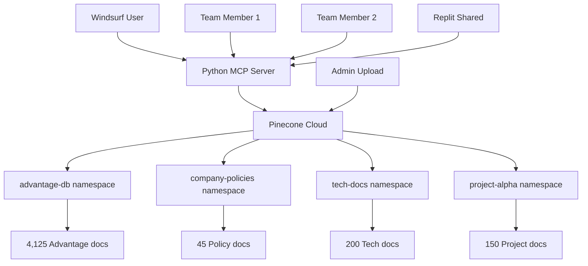
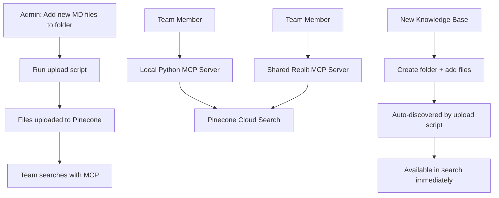

# 🚀 Pinecone Knowledge Base System - Complete Technical Specification

## 📋 Project Overview

Build a two-part enterprise knowledge base system using Pinecone + OpenAI that separates data management from search access, enabling scalable team collaboration with cloud infrastructure.

**Key Innovation**: Simple folder-based knowledge base management - just add a folder with `.md` files to create a new searchable knowledge base.

---

## 📁 Project Structure

```
knowledge-base-system/
├── admin-tools/                    # Part 1: Admin upload tools (your computer only)
│   ├── upload_to_pinecone.py      # Main upload script with progress tracking
│   ├── upload_config.yaml         # Knowledge base repository configuration
│   ├── upload_status.py           # Monitor upload progress and Pinecone stats
│   ├── requirements.txt           # Python dependencies
│   ├── .env.example               # Environment variables template
│   └── README.md                  # Setup and usage documentation
│
├── mcp-server/                     # Part 2: Team MCP server (shared)
│   ├── mcp_pinecone_server.py     # Main MCP server implementation
│   ├── pinecone_client.py         # Pinecone search and connection management
│   ├── mcp_config.py              # Configuration and environment management
│   ├── requirements.txt           # Minimal dependencies for team deployment
│   ├── deploy_replit.md           # Replit deployment instructions
│   ├── team_setup.md              # Team member onboarding guide
│   └── README.md                  # MCP server documentation
│
├── knowledge-bases/               # Knowledge base content (folder = KB)
│   ├── advantage/                 # Advantage Database Server docs
│   │   ├── *.md                   # All markdown files
│   │   └── chunks.jsonl           # Pre-processed chunks (optional)
│   ├── company-policies/          # Example: Company policies KB
│   │   └── *.md                   # Policy documents
│   ├── technical-docs/            # Example: Technical documentation KB
│   │   └── *.md                   # Technical guides
│   ├── project-notes/             # Example: Project documentation KB
│   │   └── *.md                   # Project files
│   └── [any-folder-name]/         # Any folder becomes a searchable KB
│       └── *.md                   # Just add markdown files
│
├── config/                        # Global configuration
│   ├── global_config.yaml         # System-wide settings
│   └── repository_mapping.yaml   # Folder to namespace mapping
│
└── docs/                          # Documentation
    ├── SETUP_GUIDE.md             # Complete setup instructions
    ├── USAGE_EXAMPLES.md          # Usage examples and tutorials
    └── TROUBLESHOOTING.md         # Common issues and solutions
```

---

## 🎯 Part 1: Admin Upload System (Your Computer Only)

### Objective
Python scripts for uploading multiple knowledge base repositories to Pinecone with OpenAI embeddings. Handles automatic folder discovery and namespace management.

### Core Requirements

#### **1. Automatic Knowledge Base Discovery**
```python
# System automatically discovers knowledge bases from folder structure
knowledge_bases = {
    "advantage": {
        "path": "knowledge-bases/advantage/",
        "namespace": "advantage-db",
        "description": "Advantage Database Server Documentation",
        "file_count": 4125,
        "last_updated": "2025-09-02"
    },
    "company-policies": {
        "path": "knowledge-bases/company-policies/", 
        "namespace": "company-policies",
        "description": "Company Policy Documents",
        "file_count": 45,
        "last_updated": "2025-09-01"
    }
    # Additional KBs discovered automatically...
}
```

#### **2. Configuration Management**
```yaml
# upload_config.yaml
api_keys:
  openai_api_key: "${OPENAI_API_KEY}"
  pinecone_api_key: "${PINECONE_API_KEY}"

pinecone:
  environment: "us-west1-gcp-free"  # or your Pinecone environment
  index_name: "knowledge-base-index"
  dimension: 1536  # for text-embedding-ada-002

embedding:
  provider: "openai"
  model: "text-embedding-ada-002"  # or text-embedding-3-small
  batch_size: 100
  max_tokens_per_chunk: 8000

repositories:
  base_path: "knowledge-bases/"
  auto_discover: true
  exclude_patterns:
    - ".*"          # Hidden files
    - "*.tmp"       # Temporary files
    - "*.log"       # Log files
  include_extensions:
    - ".md"
    - ".txt"
    - ".jsonl"      # Pre-processed chunks

upload:
  chunk_size: 1000
  chunk_overlap: 100
  batch_upload_size: 50
  retry_attempts: 3
  retry_delay: 2
```

#### **3. Command Line Interface**
```bash
# Discover and show all available knowledge bases
python upload_to_pinecone.py --discover

# Upload specific knowledge base
python upload_to_pinecone.py --repo advantage --verbose

# Upload all knowledge bases with progress
python upload_to_pinecone.py --all --progress

# Force complete rebuild of specific KB
python upload_to_pinecone.py --repo advantage --force-rebuild

# Incremental update (only changed files)
python upload_to_pinecone.py --all --incremental

# Show statistics without uploading
python upload_to_pinecone.py --stats --dry-run

# Upload with custom namespace
python upload_to_pinecone.py --repo policies --namespace custom-policies
```

#### **4. Progress Tracking Features**
- **Real-time Progress Bar**: Current file, percentage, files processed/total, ETA
- **Detailed Logging**: `.upload.log` with timestamps and operation details
- **Performance Metrics**: Files/sec, embeddings/sec, upload throughput
- **Error Recovery**: Skip failed files and continue, detailed error reporting
- **Incremental Detection**: SHA256 hashing to detect file changes
- **Batch Status**: Track Pinecone upload batches and retry failed uploads

#### **5. Multi-Repository Management**
```python
# Automatic namespace generation from folder names
folder_name = "advantage"           → namespace = "advantage-db"
folder_name = "company-policies"    → namespace = "company-policies"  
folder_name = "technical-docs"      → namespace = "tech-docs"
folder_name = "project-alpha"       → namespace = "project-alpha"

# Custom namespace mapping in config
namespace_mapping = {
    "advantage": "advantage-database-server",
    "policies": "company-policies-2025",
    "docs": "technical-documentation"
}
```

---

## 🌐 Part 2: Python MCP Server (Team Shared)

### Objective
Lightweight Python MCP server that connects to Pinecone for semantic search. Can be deployed locally by team members or hosted on Replit for shared access.

### Core Requirements

#### **1. MCP Protocol Implementation**
```python
# MCP Tools to implement
tools = [
    {
        "name": "list_knowledge_bases",
        "description": "List all available knowledge base repositories",
        "parameters": {}
    },
    {
        "name": "search_knowledge", 
        "description": "Search across knowledge bases with semantic similarity",
        "parameters": {
            "query": {"type": "string", "required": True},
            "repository": {"type": "string", "required": False},
            "limit": {"type": "integer", "default": 10},
            "threshold": {"type": "float", "default": 0.8}
        }
    },
    {
        "name": "get_repository_stats",
        "description": "Get statistics for specific or all repositories", 
        "parameters": {
            "repository": {"type": "string", "required": False}
        }
    },
    {
        "name": "health_check",
        "description": "Check Pinecone connectivity and system status",
        "parameters": {}
    }
]
```

#### **2. Search Functionality**
```python
# Search interface examples
@kb list repositories
# Returns: advantage-db, company-policies, tech-docs, project-alpha

@kb search "temporary tables" --repo advantage-db  
# Search only Advantage database

@kb search "employee policies" --repo company-policies
# Search only company policies

@kb search "API documentation" 
# Search across all repositories

@kb search "database performance" --limit 5 --threshold 0.9
# High-relevance results only
```

#### **3. Multi-Repository Architecture**


#### **4. Configuration Management**
```python
# mcp_config.py
class PineconeConfig:
    api_key = os.getenv("PINECONE_API_KEY")
    environment = os.getenv("PINECONE_ENV", "us-west1-gcp-free")
    index_name = os.getenv("PINECONE_INDEX", "knowledge-base-index")
    
    # Repository namespace mapping
    namespaces = {
        "advantage": "advantage-db",
        "policies": "company-policies", 
        "docs": "tech-docs",
        "default": "general-knowledge"
    }
    
    # Search defaults
    default_limit = 10
    default_threshold = 0.8
    max_results = 50
```

#### **5. Deployment Options**

**Local Team Member Setup:**
```bash
# Clone MCP server
git clone <repo> knowledge-base-mcp
cd knowledge-base-mcp/mcp-server

# Install dependencies  
pip install -r requirements.txt

# Configure environment
cp .env.example .env
# Edit .env with Pinecone API key

# Run MCP server
python mcp_pinecone_server.py --local
```

**Replit Shared Deployment:**
```bash
# Deploy to Replit for team sharing
# Upload mcp-server/ folder to Replit
# Set environment variables in Replit secrets
# Run: python mcp_pinecone_server.py --cloud --port 3000

# Team members connect via:
# MCP server URL: https://your-replit.repl.co
```

---

## 🔧 Technical Implementation Details

### **Folder-Based Knowledge Base Management**

**Simple Addition Process:**
1. **Create Folder**: `mkdir knowledge-bases/new-project`
2. **Add Markdown Files**: Copy `.md` files into the folder
3. **Upload**: `python upload_to_pinecone.py --repo new-project`
4. **Search**: `@kb search "query" --repo new-project`

**Automatic Processing:**
- **Folder Discovery**: System scans `knowledge-bases/` directory
- **Namespace Creation**: Folder name → Pinecone namespace  
- **File Detection**: All `.md` files processed automatically
- **Metadata Preservation**: File paths, titles, last modified dates

### **File Processing Pipeline**
```python
# Processing workflow for each KB folder
def process_knowledge_base(folder_path):
    1. Scan folder for .md files recursively
    2. Check for existing chunks.jsonl (from Python toolkit)
    3. If chunks.jsonl exists: use pre-processed chunks
    4. If not: create chunks from markdown files
    5. Generate OpenAI embeddings for each chunk
    6. Upload to Pinecone with namespace = folder_name
    7. Update local hash tracking for incremental updates
```

### **Search Architecture**
```python
# Search request flow
def search_knowledge(query, repository=None):
    1. Generate OpenAI embedding for search query
    2. Determine target namespaces:
       - If repository specified: use that namespace
       - If not specified: search all namespaces
    3. Query Pinecone with vector similarity
    4. Format results with source attribution
    5. Return markdown-formatted response
```

---

## 📊 Performance Specifications

### **Upload Performance Targets**
- **Small KB** (10-100 files): 2-5 minutes
- **Medium KB** (100-1000 files): 10-30 minutes  
- **Large KB** (1000+ files): 30-90 minutes
- **Incremental Updates**: 1-10 minutes regardless of KB size

### **Search Performance Targets**
- **Query Response Time**: <500ms for any repository size
- **Multi-Repository Search**: <1000ms across all namespaces
- **Concurrent Users**: Support 10+ simultaneous searches
- **Availability**: 99.5%+ uptime using Pinecone infrastructure

---

## 🔑 Environment Variables

### **Admin Upload System**
```bash
# .env file for admin tools
OPENAI_API_KEY=sk-your-openai-key
PINECONE_API_KEY=your-pinecone-key  
PINECONE_ENVIRONMENT=us-west1-gcp-free
PINECONE_INDEX_NAME=knowledge-base-index
KNOWLEDGE_BASES_ROOT=./knowledge-bases/
LOG_LEVEL=INFO
```

### **MCP Server**
```bash
# .env file for MCP server
PINECONE_API_KEY=your-pinecone-key
PINECONE_ENVIRONMENT=us-west1-gcp-free  
PINECONE_INDEX_NAME=knowledge-base-index
MCP_SERVER_PORT=3000
LOG_LEVEL=INFO
```

---

## 🛠️ Implementation Requirements

### **Part 1: Admin Upload Scripts**

#### **upload_to_pinecone.py**
```python
# Key functions to implement
class KnowledgeBaseUploader:
    def discover_repositories() -> Dict[str, KBInfo]
    def upload_repository(repo_name: str, force_rebuild: bool = False)
    def upload_all_repositories(incremental: bool = True)
    def get_upload_stats() -> Dict[str, Any]
    def health_check() -> bool
    
    # Progress tracking
    def show_progress_bar(current: int, total: int, file_name: str)
    def log_operation(message: str, level: str = "INFO")
    def estimate_completion_time(processed: int, total: int, start_time: float)
    
    # File processing  
    def process_markdown_files(folder_path: str) -> List[Document]
    def process_jsonl_chunks(file_path: str) -> List[Document]
    def generate_embeddings(documents: List[Document]) -> List[Dict]
    def upload_to_pinecone(vectors: List[Dict], namespace: str)
```

#### **upload_status.py**
```python
# Monitoring functions to implement
class UploadMonitor:
    def show_current_status() -> Dict[str, Any]
    def list_pinecone_namespaces() -> List[str]
    def get_namespace_stats(namespace: str) -> Dict[str, Any]
    def monitor_live_upload() -> None  # Real-time monitoring
    def export_stats_report() -> str   # Generate status report
```

### **Part 2: Python MCP Server**

#### **mcp_pinecone_server.py**
```python
# MCP protocol implementation
class PineconeMCPServer:
    def __init__(self, config: PineconeConfig)
    
    # MCP tool handlers
    async def handle_list_knowledge_bases() -> List[str]
    async def handle_search_knowledge(query: str, repository: str = None, limit: int = 10) -> SearchResults
    async def handle_get_repository_stats(repository: str = None) -> Dict[str, Any]
    async def handle_health_check() -> Dict[str, bool]
    
    # Search functionality
    async def search_single_namespace(query: str, namespace: str, limit: int) -> List[SearchResult]
    async def search_all_namespaces(query: str, limit: int) -> List[SearchResult]
    async def format_search_results(results: List[SearchResult]) -> str
```

#### **pinecone_client.py**
```python
# Pinecone connection management
class PineconeClient:
    def __init__(self, api_key: str, environment: str, index_name: str)
    def connect() -> bool
    def list_namespaces() -> List[str]
    def query_namespace(vector: List[float], namespace: str, top_k: int) -> List[Match]
    def get_namespace_stats(namespace: str) -> Dict[str, Any]
    def health_check() -> bool
```

---

## 📖 Usage Examples

### **Adding a New Knowledge Base**

**Step 1: Create Folder Structure**
```bash
mkdir knowledge-bases/customer-support
```

**Step 2: Add Content**
```bash
# Copy your markdown files
cp *.md knowledge-bases/customer-support/
```

**Step 3: Upload to Pinecone**
```bash
python admin-tools/upload_to_pinecone.py --repo customer-support
```

**Step 4: Search (via MCP)**
```
@kb search "troubleshooting" --repo customer-support
```

### **Team Member Setup**

**Option 1: Local MCP Server**
```bash
git clone <repo> my-knowledge-base
cd my-knowledge-base/mcp-server
pip install -r requirements.txt
python mcp_pinecone_server.py --local
```

**Option 2: Shared Replit Server**
```bash
# Connect to shared Replit deployment
# MCP Server URL: https://kb-server.your-team.repl.co
# Add to Windsurf MCP settings
```

---

## 🔍 Search Interface Specifications

### **MCP Tool Responses**

#### **list_knowledge_bases**
```json
{
  "repositories": [
    {"name": "advantage-db", "files": 4125, "size": "22.3MB", "last_updated": "2025-09-02"},
    {"name": "company-policies", "files": 45, "size": "1.2MB", "last_updated": "2025-09-01"},
    {"name": "tech-docs", "files": 200, "size": "5.8MB", "last_updated": "2025-08-30"}
  ]
}
```

#### **search_knowledge**
```markdown
## Search Results for "temporary tables"

**Result 1 - Score: 0.95**
### Creating Temporary Tables in Advantage SQL
Temporary tables in Advantage can be created using the CREATE TABLE statement with the TEMPORARY keyword...

**Source**: advantage-db/devguide_temporary_tables.md
**Repository**: advantage-db

---

**Result 2 - Score: 0.89**  
### Temporary Table Management
When working with temporary tables, consider the following best practices...

**Source**: advantage-db/master_temporary_tables.md
**Repository**: advantage-db
```

---

## 🚀 Deployment Strategies

### **Development Workflow**


### **Team Distribution Options**

**Option A: Individual Setup**
- Each team member runs local Python MCP server
- Connects to shared Pinecone index
- Full functionality, personal customization

**Option B: Shared Replit Server**  
- Single Replit deployment for entire team
- Team members connect via URL
- Centralized management, zero individual setup

**Option C: Hybrid Approach**
- Critical team members: local setup
- Occasional users: shared Replit server
- Admin maintains both deployment options

---

## 📋 Implementation Checklist

### **Part 1: Upload System**
- [ ] Auto-discover folders in `knowledge-bases/` directory
- [ ] Generate Pinecone namespaces from folder names
- [ ] Process both `.md` files and `.jsonl` pre-chunks
- [ ] Implement OpenAI embedding generation with batching
- [ ] Add comprehensive progress tracking and logging
- [ ] Handle incremental updates with SHA256 change detection
- [ ] Support force rebuild and selective repository updates
- [ ] Add error recovery and retry logic for API failures

### **Part 2: MCP Server**
- [ ] Implement full MCP protocol in Python
- [ ] Connect to Pinecone with namespace awareness
- [ ] Support multi-repository search and filtering
- [ ] Format results with source attribution and relevance scores
- [ ] Add health checking and error handling
- [ ] Support both local and cloud deployment modes
- [ ] Create team onboarding documentation
- [ ] Test with Windsurf MCP integration

### **Documentation**
- [ ] Complete setup guide with prerequisites
- [ ] Usage examples for all common scenarios  
- [ ] Troubleshooting guide for API and connectivity issues
- [ ] Team deployment instructions for both local and Replit
- [ ] Performance optimization recommendations

---

## 🎯 Success Criteria

**Upload System:**
- ✅ Process 4,000+ files in under 60 minutes
- ✅ Support 10+ different knowledge base repositories
- ✅ Incremental updates complete in under 10 minutes
- ✅ Zero data loss during upload failures

**MCP Server:**  
- ✅ Search responses consistently under 500ms
- ✅ Team member setup in under 15 minutes
- ✅ Support 20+ concurrent users without degradation
- ✅ 99.5%+ uptime for shared deployments

**User Experience:**
- ✅ Add new knowledge base: create folder + run one command
- ✅ Search any repository: simple `@kb search` interface
- ✅ Team sharing: copy MCP server or use shared Replit URL
- ✅ Zero local storage/indexing requirements for team members

This system eliminates all current local constraints while providing enterprise-grade performance, scalability, and team collaboration through cloud infrastructure with simple folder-based knowledge base management.