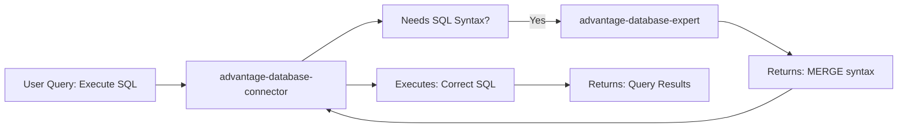

# Enhanced MCP Configuration Proposal (Simplified)

## Current vs Enhanced Configuration Comparison

### BEFORE (Current Generic Names):
```json
"pinecone-kb-sse local": {
  "type": "sse",
  "url": "http://localhost:3000/sse",
  "headers": {
    "Authorization": "Bearer dev-local-123"
  },
  "disabled": false,
  "alwaysAllow": ["list_knowledge_bases", "get_repository_stats", ...]
}
```

### AFTER (Enhanced with Simplified Metadata):
```json
"advantage-database-expert-local": {
  "type": "sse",
  "url": "http://localhost:3000/sse",
  "headers": {
    "Authorization": "Bearer dev-local-123"
  },
  "disabled": false,
  "description": "Expert knowledge base for Advantage Database Server - comprehensive SQL, configuration, and troubleshooting support",
  "capabilities": {
    "domains": [
      "advantage_database",
      "sql",
      "database_operations", 
      "performance_tuning",
      "database_administration",
      "data_modeling"
    ],
    "specialties": [
      "upsert_merge_operations",
      "indexing_optimization", 
      "transaction_management",
      "stored_procedures",
      "triggers_and_constraints",
      "backup_recovery",
      "replication",
      "connection_management"
    ],
    "query_types": [
      "how_to_guides",
      "reference_lookup",
      "troubleshooting",
      "code_examples",
      "best_practices",
      "configuration_help",
      "performance_analysis"
    ],
    "output_formats": ["explanations", "code_examples", "step_by_step", "citations"]
  },
  "use_cases": {
    "best_for": [
      "Advantage Database Server specific SQL syntax and operations",
      "MERGE statement and upsert operations in Advantage", 
      "Database performance optimization and troubleshooting",
      "Advantage-specific configuration and administration",
      "Migration from other databases to Advantage",
      "Complex SQL query optimization for Advantage"
    ],
    "not_suitable_for": [
      "General programming questions unrelated to databases",
      "Other database systems (MySQL, PostgreSQL, Oracle, SQL Server)",
      "Frontend development or UI/UX questions",
      "Non-database server administration", 
      "Real-time data streaming or big data analytics",
      "Mobile app development"
    ],
    "example_queries": [
      "How to perform an upsert in Advantage Database?",
      "What is the MERGE syntax in Advantage SQL?",
      "How to optimize index performance in Advantage?",
      "Troubleshooting connection issues with Advantage Database Server",
      "Best practices for stored procedures in Advantage"
    ]
  },
  "tool_relationships": {
    "provides_support_to": [
      "advantage-database-connector",
      "sql-query-executor"
    ],
    "notes": "This documentation tool can be referenced by database connection tools that need Advantage-specific SQL syntax"
  },
  "alwaysAllow": [
    "list_knowledge_bases",
    "get_repository_stats",
    "list_recent_updates", 
    "health_check",
    "get_doc",
    "search_kb",
    "synthesize_answer",
    "answer_knowledge"
  ],
  "autoApprove": []
}
```

## Complete Simplified Configuration File

```json
{
  "mcpServers": {
    "github.com/NightTrek/Software-planning-mcp": {
      "command": "node",
      "args": [
        "c:\\Prog\\Source\\github.com\\NightTrek\\Software-planning-mcp\\build\\index.js"
      ],
      "disabled": false,
      "autoApprove": [],
      "alwaysAllow": [
        "start_planning",
        "add_todo"
      ]
    },
    "github.com/browserbase/mcp-server-browserbase/tree/main/stagehand": {
      "command": "node",
      "args": [
        "c:\\Prog\\Source\\github.com\\browserbase\\mcp-server-browserbase\\stagehand\\stagehand\\dist\\index.js"
      ],
      "env": {
        "OPENAI_API_KEY": "",
        "BROWSERBASE_API_KEY": "bb_live_rxWfwGKs7wvjvFNCe36qkhPAa6c",
        "BROWSERBASE_PROJECT_ID": "f28d8b57-1d02-4a75-9d68-5176fdd9e095"
      },
      "disabled": false,
      "autoApprove": [],
      "alwaysAllow": [
        "stagehand_navigate"
      ]
    },
    "github.com/modelcontextprotocol/servers/tree/main/src/sequentialthinking": {
      "command": "npx",
      "args": [
        "-y",
        "@modelcontextprotocol/server-sequential-thinking"
      ],
      "disabled": false,
      "autoApprove": [],
      "alwaysAllow": [
        "sequential_thinking",
        "sequentialthinking"
      ]
    },
    "git": {
      "command": "uvx",
      "args": [
        "mcp-server-git",
        "--repository",
        "/Prog/Source/Tis01"
      ],
      "disabled": false,
      "alwaysAllow": []
    },
    "memory": {
      "command": "npx",
      "args": [
        "-y",
        "@modelcontextprotocol/server-memory"
      ]
    },
    "context7": {
      "command": "npx",
      "args": [
        "-y",
        "@upstash/context7-mcp"
      ],
      "env": {
        "DEFAULT_MINIMUM_TOKENS": ""
      },
      "disabled": false,
      "alwaysAllow": [
        "resolve-library-id",
        "get-library-docs"
      ]
    },
    "filesystem": {
      "command": "npx",
      "args": [
        "-y",
        "@modelcontextprotocol/server-filesystem",
        "C:\\"
      ],
      "alwaysAllow": [
        "read_text_file",
        "list_directory",
        "list_allowed_directories"
      ],
      "disabled": false
    },
    "postgres": {
      "command": "npx",
      "args": [
        "-y",
        "@modelcontextprotocol/server-postgres",
        "postgresql://postgres@localhost:5432/tiswin3dd"
      ],
      "alwaysAllow": [
        "query"
      ]
    },
    "advantage-database-expert-local": {
      "type": "sse",
      "url": "http://localhost:3000/sse",
      "headers": {
        "Authorization": "Bearer dev-local-123"
      },
      "disabled": false,
      "description": "Expert knowledge base for Advantage Database Server - comprehensive SQL, configuration, and troubleshooting support",
      "capabilities": {
        "domains": [
          "advantage_database",
          "sql",
          "database_operations",
          "performance_tuning",
          "database_administration",
          "data_modeling"
        ],
        "specialties": [
          "upsert_merge_operations",
          "indexing_optimization",
          "transaction_management", 
          "stored_procedures",
          "triggers_and_constraints",
          "backup_recovery",
          "replication",
          "connection_management"
        ],
        "query_types": [
          "how_to_guides",
          "reference_lookup",
          "troubleshooting",
          "code_examples",
          "best_practices",
          "configuration_help",
          "performance_analysis"
        ],
        "output_formats": ["explanations", "code_examples", "step_by_step", "citations"]
      },
      "use_cases": {
        "best_for": [
          "Advantage Database Server specific SQL syntax and operations",
          "MERGE statement and upsert operations in Advantage",
          "Database performance optimization and troubleshooting",
          "Advantage-specific configuration and administration",
          "Migration from other databases to Advantage",
          "Complex SQL query optimization for Advantage"
        ],
        "not_suitable_for": [
          "General programming questions unrelated to databases",
          "Other database systems (MySQL, PostgreSQL, Oracle, SQL Server)",
          "Frontend development or UI/UX questions",
          "Non-database server administration",
          "Real-time data streaming or big data analytics",
          "Mobile app development"
        ],
        "example_queries": [
          "How to perform an upsert in Advantage Database?",
          "What is the MERGE syntax in Advantage SQL?",
          "How to optimize index performance in Advantage?",
          "Troubleshooting connection issues with Advantage Database Server",
          "Best practices for stored procedures in Advantage"
        ]
      },
      "tool_relationships": {
        "provides_support_to": [
          "advantage-database-connector",
          "sql-query-executor"
        ],
        "notes": "This documentation tool can be referenced by database connection tools that need Advantage-specific SQL syntax"
      },
      "alwaysAllow": [
        "list_knowledge_bases",
        "get_repository_stats",
        "list_recent_updates",
        "health_check",
        "get_doc",
        "search_kb",
        "synthesize_answer",
        "answer_knowledge"
      ],
      "autoApprove": []
    },
    "advantage-database-expert-flyio": {
      "type": "sse",
      "url": "https://advantage-mcp-server.fly.dev/sse",
      "headers": {
        "Authorization": "Bearer dev-local-123"
      },
      "disabled": true,
      "description": "Expert knowledge base for Advantage Database Server - comprehensive SQL, configuration, and troubleshooting support",
      "capabilities": {
        "domains": [
          "advantage_database",
          "sql",
          "database_operations",
          "performance_tuning",
          "database_administration",
          "data_modeling"
        ],
        "specialties": [
          "upsert_merge_operations",
          "indexing_optimization",
          "transaction_management",
          "stored_procedures",
          "triggers_and_constraints",
          "backup_recovery",
          "replication",
          "connection_management"
        ],
        "query_types": [
          "how_to_guides",
          "reference_lookup",
          "troubleshooting",
          "code_examples",
          "best_practices",
          "configuration_help",
          "performance_analysis"
        ],
        "output_formats": ["explanations", "code_examples", "step_by_step", "citations"]
      },
      "use_cases": {
        "best_for": [
          "Advantage Database Server specific SQL syntax and operations",
          "MERGE statement and upsert operations in Advantage",
          "Database performance optimization and troubleshooting",
          "Advantage-specific configuration and administration",
          "Migration from other databases to Advantage",
          "Complex SQL query optimization for Advantage"
        ],
        "not_suitable_for": [
          "General programming questions unrelated to databases",
          "Other database systems (MySQL, PostgreSQL, Oracle, SQL Server)",
          "Frontend development or UI/UX questions",
          "Non-database server administration",
          "Real-time data streaming or big data analytics",
          "Mobile app development"
        ],
        "example_queries": [
          "How to perform an upsert in Advantage Database?",
          "What is the MERGE syntax in Advantage SQL?",
          "How to optimize index performance in Advantage?",
          "Troubleshooting connection issues with Advantage Database Server",
          "Best practices for stored procedures in Advantage"
        ]
      },
      "tool_relationships": {
        "provides_support_to": [
          "advantage-database-connector",
          "sql-query-executor"
        ],
        "notes": "This documentation tool can be referenced by database connection tools that need Advantage-specific SQL syntax"
      },
      "alwaysAllow": [
        "list_knowledge_bases",
        "get_repository_stats",
        "list_recent_updates",
        "health_check",
        "get_doc",
        "synthesize_answer",
        "answer_knowledge"
      ],
      "autoApprove": []
    }
  }
}
```

## Future Database Template Structure (Simplified)

When adding new databases (SAP, Oracle, etc.), use this template:

```json
"[database-name]-database-expert-[deployment]": {
  "type": "sse",
  "url": "[endpoint-url]",
  "headers": {
    "Authorization": "Bearer [token]"
  },
  "disabled": false,
  "description": "Expert knowledge base for [Database Name] - [brief capability description]",
  "capabilities": {
    "domains": ["[database_name]", "sql", "database_operations", "..."],
    "specialties": ["[database-specific features]", "..."],
    "query_types": ["how_to_guides", "reference_lookup", "troubleshooting", "..."],
    "output_formats": ["explanations", "code_examples", "step_by_step", "citations"]
  },
  "use_cases": {
    "best_for": ["[specific use cases for this database]"],
    "not_suitable_for": ["[what this tool should not be used for]"],
    "example_queries": ["[sample queries this tool handles well]"]
  },
  "tool_relationships": {
    "provides_support_to": ["[database-name]-database-connector"],
    "notes": "[how other tools can use this one]"
  },
  "alwaysAllow": ["[tool names]"],
  "autoApprove": []
}
```

## Tool-to-Tool Communication Strategy



The `tool_relationships` metadata enables:
1. **Tool Discovery**: Database connector tools can find relevant documentation tools
2. **Dependency Management**: Clear relationships between execution and documentation tools  
3. **Intelligent Routing**: AI can route syntax questions to docs, execution to connectors

## Key Changes Summary

1. **Names**: `pinecone-kb-sse local` → `advantage-database-expert-local`
2. **Names**: `pinecone-kb-flyio` → `advantage-database-expert-flyio`
3. **Added**: Rich but simplified metadata for intelligent tool selection
4. **Added**: `tool_relationships` for future database connector integration
5. **Removed**: Complex scoring and performance metrics (simplified)
6. **Template**: Ready structure for future database additions

This simplified configuration enables AI systems to intelligently select tools while being much easier to maintain and understand.